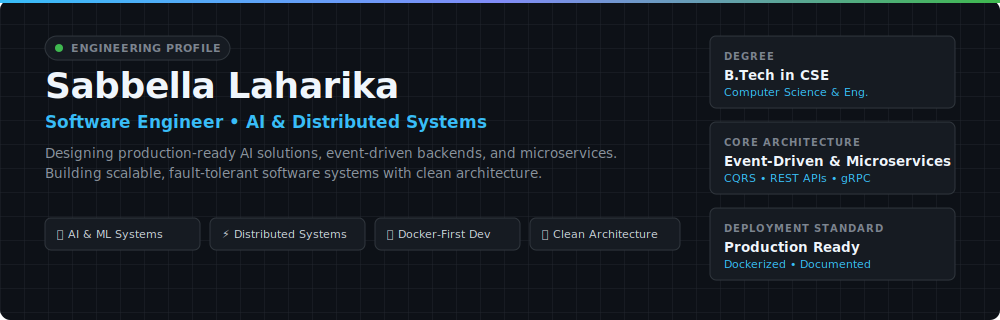
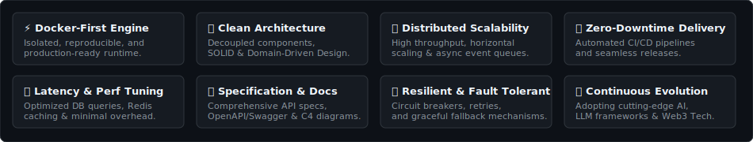

<div align="center">
  
</div>

<br />

<div align="center">
  <a href="https://linkedin.com">
    
  </a>
  <a href="mailto:laharikasabbella@gmail.com">
    
  </a>
  <a href="https://github.com/SabbellaLaharika">
    
  </a>
</div>

<br />

<div align="center">
  
</div>

## 🎯 Executive Engineering Profile

> **Software Engineer** specializing in **Artificial Intelligence, Distributed Backends, and High-Throughput Microservices**. Focused on shipping maintainable, production-ready software systems with strict adherence to clean architecture, containerized isolation, and low-latency API design.

```typescript
type SystemsEngineer = {
  name: "Sabbella Laharika",
  education: "B.Tech in Computer Science Engineering",
  primaryFocus: ["AI Systems & LLMs", "Distributed Backends", "Event-Driven Microservices"],
  engineeringStandards: ["Docker-First Runtime", "CQRS / Event Sourcing", "Clean Architecture"],
  status: "Available for Software Engineering & AI Backend Roles"
};
```

<br />

<div align="center">
  
</div>

## ⚙️ Core Technology Matrix

```
┌──────────────────────────────┬─────────────────────────────────────────────────────────────────────────┐
│ Domain                       │ Technical Capabilities & Production Stack                               │
├──────────────────────────────┼─────────────────────────────────────────────────────────────────────────┤
│ AI & Autonomous Systems      │ LangChain • LlamaIndex • PyTorch • YOLOv8 • OpenCV • Prompt Routers     │
│ Distributed Backends & APIs  │ Python (FastAPI/Flask) • Java (Spring Boot) • Node.js/TypeScript • gRPC│
│ Databases & In-Memory Stores │ PostgreSQL (Indexing/Transactions) • MongoDB • Redis (PubSub/Caching)   │
│ Architecture & DevOps        │ Microservices • Event Sourcing • CQRS • Docker & Compose • CI/CD        │
│ Real-Time Media & Protocols  │ WebRTC (ICE/STUN/TURN) • WebSockets • RESTful API Design                │
└──────────────────────────────┴─────────────────────────────────────────────────────────────────────────┘
```

<br />

<div align="center">
  
</div>

## 🚀 Featured Engineering Systems

<br />

### 1. 🏥 MedEcho — AI-Powered Healthcare Diagnostic System
> **Architecture:** Microservices | **Primary Tech:** `Python` `FastAPI` `PyTorch` `React` `PostgreSQL` `Docker`

- **System Design:** Distributed AI healthcare engine designed for real-time patient metrics ingestion and automated diagnostic summary synthesis via LLMs.
- **Production Standard:** Fully containerized with multi-stage Docker builds, isolated DB schemas, and automated test coverage.
- 🔗 **Repository:** [SabbellaLaharika/MedEcho](https://github.com/SabbellaLaharika) | 📹 **Demo**: Available in Repo

---

### 2. 🏛️ AI Climate Policy Debate Simulator
> **Architecture:** Multi-Agent LLM Orchestration | **Primary Tech:** `LangChain` `OpenAI API` `FastAPI` `Redis` `TypeScript`

- **System Design:** Multi-agent framework executing structured policy debates between autonomous AI personas using a custom dynamic prompt router.
- **Optimization:** Leverages Redis key-value caching to reduce duplicate LLM inference calls and optimize token throughput.
- 🔗 **Repository:** [SabbellaLaharika/AI-Climate-Debate-Simulator](https://github.com/SabbellaLaharika) | 📹 **Demo**: Available in Repo

---

### 3. 📹 Production WebRTC Video Chat Platform
> **Architecture:** Low-Latency Peer-to-Peer | **Primary Tech:** `Node.js` `WebRTC` `WebSockets` `Redis` `React`

- **System Design:** High-concurrency peer-to-peer video streaming engine with dynamic STUN/TURN server candidate negotiation.
- **Scalability:** Distributed WebSocket signaling across multiple server nodes using a Redis Pub/Sub event bus.
- 🔗 **Repository:** [SabbellaLaharika/WebRTC-Video-Platform](https://github.com/SabbellaLaharika) | 📹 **Demo**: Available in Repo

---

### 4. 🏦 Event Sourcing & CQRS Banking Engine
> **Architecture:** CQRS & Event Sourcing | **Primary Tech:** `Java` `Spring Boot` `Kafka` `PostgreSQL` `MongoDB`

- **System Design:** Financial transaction backend strictly decoupling Write commands (PostgreSQL) from Read queries (MongoDB) for zero data loss and auditability.
- **Fault Tolerance:** Asynchronous event streaming via Kafka ensuring eventual consistency across distributed read models.
- 🔗 **Repository:** [SabbellaLaharika/CQRS-Banking-System](https://github.com/SabbellaLaharika) | 📹 **Demo**: Available in Repo

---

### 5. 🎯 YOLOv8 Object Detection & Streaming Pipeline
> **Architecture:** Edge AI Inference | **Primary Tech:** `Python` `YOLOv8` `OpenCV` `PyTorch` `FastAPI`

- **System Design:** Real-time video frame parsing and object tracking API optimized for low-latency edge deployment.
- **Performance:** Hardware-accelerated tensor batching delivering low-latency inference over REST & WebSockets streams.
- 🔗 **Repository:** [SabbellaLaharika/YOLOv8-Object-Detection](https://github.com/SabbellaLaharika) | 📹 **Demo**: Available in Repo

---

### 6. 🌐 Distributed Multi-Channel Notification Service
> **Architecture:** Distributed Task Queue | **Primary Tech:** `TypeScript` `Node.js` `Redis (BullMQ)` `MongoDB`

- **System Design:** High-throughput transactional notification dispatcher supporting Email, SMS, and Push channels.
- **Reliability:** Built-in exponential backoff retries, dead-letter queues (DLQ), and token-bucket rate limiting.
- 🔗 **Repository:** [SabbellaLaharika/Distributed-Notification-Service](https://github.com/SabbellaLaharika) | 📹 **Demo**: Available in Repo

<br />

<details>
<summary>📂 <b>View Complete Engineering Portfolio (11 Additional Systems)</b></summary>
<br />

| System / Project | Architectural Focus | Core Tech |
| :--- | :--- | :--- |
| **AI Conversational Form Builder** | Real-time conditional logic tree generation | `React`, `Node.js`, `OpenAI` |
| **MongoDB Collaborative Store** | Real-time operational transformation backend | `MongoDB`, `WebSockets`, `Express` |
| **Prompt Router** | Dynamic cost & latency model routing engine | `Python`, `FastAPI` |
| **Offline AI Chatbot** | Privacy-focused quantized local LLM runtime | `C++`, `Python`, `Ollama` |
| **Blockchain Oracle** | Trustless off-chain to on-chain data bridge | `Solidity`, `Web3.js`, `Node.js` |
| **Reinforcement Learning Agent** | Autonomous decision agent in Gym env | `PyTorch`, `OpenAI Gym` |
| **Secure PKI Authentication** | Zero-Trust public key cryptosystem | `Java`, `Spring Security` |
| **Production Payment Gateway** | PCI-compliant transaction processing engine | `Node.js`, `PostgreSQL`, `Stripe` |
| **High-Performance Code Editor** | Containerized remote code execution sandbox | `Docker`, `WebSockets`, `React` |
| **AI Email Auto-Responder** | Contextual email triage & agentic responder | `Python`, `LangChain`, `Gmail API` |
| **SaaS CRM Platform** | Multi-tenant schema-isolated architecture | `Next.js`, `PostgreSQL`, `Docker` |

</details>

<br />

<div align="center">
  
</div>

## 🛠️ Software Engineering Principles

<div align="center">
  
</div>

<br />

<div align="center">
  
</div>

## 📊 Analytics & Activity

<table align="center" width="100%">
  <tr>
    <td width="50%" align="center">
      
    </td>
    <td width="50%" align="center">
      
    </td>
  </tr>
</table>

<br />

<div align="center">
  
</div>

## 📬 Connect

<div align="center">

**Open to Software Engineering, AI/Backend, and Systems Architecture opportunities.**

[**LinkedIn**](https://www.linkedin.com/in/laharika-sabbella-791176258/) • [**Email**](mailto:laharikasabbella@gmail.com) • [**GitHub Portfolio**](https://github.com/SabbellaLaharika)

<br />

<sub>© Sabbella Laharika • Built with focus on engineering rigor</sub>
</div>
